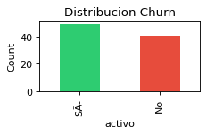
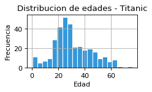
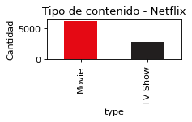
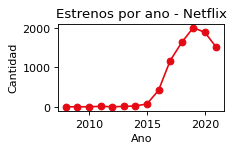
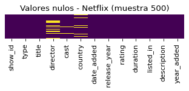
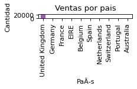
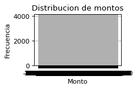
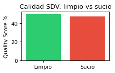

<div align="center">

# Universidad Tecnológica del Centro de Veracruz


</div>

---

## Extracción de Conocimiento en Base de Datos

### Repositorio de Prácticas

<br/>

| Alumno               | Docente         | Institución                                    | Materia                                    | Cuatrimestre | Fecha     |
|----------------------|-----------------|------------------------------------------------|--------------------------------------------|--------------|-----------|
| Martin Lara Olivares | Maria Reina Zarate Nava | Universidad Tecnológica del Centro de Veracruz | Extracción de Conocimiento en Base de Datos | 9no          | Junio 2026|

---

## Descripción General

Repositorio con 10 prácticas elaboradas en **Jupyter Notebook** para la asignatura de **Extracción de Conocimiento en Base de Datos** (ECBD) de la carrera **Ingeniería en Desarrollo de Software**.  
Cada laboratorio aborda temas progresivos: desde la creación y exploración de DataFrames con pandas, hasta la limpieza, transformación y análisis de datos aplicando los modelos **DIKW** (Data-Information-Knowledge-Wisdom) y el principio **GIGO** (Garbage In, Garbage Out).

---

## Objetivo General

Aplicar técnicas de extracción, transformación, limpieza y análisis de datos utilizando herramientas de análisis exploratorio, visualización y modelos conceptuales (DIKW, GIGO) para generar conocimiento a partir de conjuntos de datos reales y sintéticos.

---

## Datasets Utilizados

| Dataset                      | Descripción                                   | Formato |
|------------------------------|-----------------------------------------------|---------|
| `test.csv`                   | Titanic - conjunto de prueba (418 registros)  | CSV     |
| `netflix_titles.csv`         | Catálogo de títulos de Netflix (8807 registros)| CSV    |
| `dataset_sucio_practica.csv` | Datos sucios para limpieza (125 registros)    | CSV     |
| `ventas-por-factura.csv`     | Facturas de ventas (25953 registros)          | CSV     |
| `telecom_churn.csv`          | Churn de clientes de telecomunicaciones       | CSV     |
| `Data_Limpio_Factura.csv`    | Facturas limpias procesadas (20002 registros) | CSV     |
| `df_clean_facturas.csv`      | Tabla de hechos limpia para DW                | CSV     |
| `df_superstore_clean_tabla_hechos.csv` | Tabla de hechos superstore para DW      | CSV     |

---

## Herramientas Utilizadas

| Herramienta       | Versión | Propósito                            |
|-------------------|---------|--------------------------------------|
| Python            | 3.x     | Lenguaje de programación             |
| pandas            | 2.x     | Manipulación y análisis de datos     |
| matplotlib        | 3.x     | Visualización de datos               |
| seaborn           | 0.x     | Visualización estadística            |
| numpy             | 1.x     | Cómputo numérico                     |
| Jupyter Notebook  | -       | Entorno interactivo de desarrollo    |
| Anaconda          | -       | Gestión de entornos y paquetes       |
| PostgreSQL        | -       | Base de datos relacional (Data Warehouse) |
| SQLAlchemy        | 2.x     | Conexión y carga a base de datos     |
| Faker             | -       | Generación de datos sintéticos       |
| SDV               | 1.x     | Synthetic Data Vault - datos sintéticos |

---

## Estructura del Repositorio

```
📁 Extraccion-9BESC/
├── 📁 Notebooks/
│   ├── Lab01.ipynb          # Introducción a DataFrames y datos sintéticos
│   ├── Lab02.ipynb          # Datos sintéticos masivos (1M registros)
│   ├── Lab03.ipynb          # Análisis exploratorio - Telecom Churn
│   ├── Lab04.ipynb          # Modelo DIKW - Titanic
│   ├── Lab05.ipynb          # Modelo DIKW - Netflix
│   ├── Lab06.ipynb          # Limpieza de datos sucios
│   ├── Lab07.ipynb          # Principio GIGO - Facturas
│   ├── SHP.ipynb          # ETL a Data Warehouse con PostgreSQL
│   ├── Lab09.ipynb          # Datos sintéticos con Faker
│   └── Lab10.ipynb          # Datos sintéticos con SDV
├── 📁 DataSet/
│   ├── test.csv
│   ├── netflix_titles.csv
│   ├── dataset_sucio_practica.csv
│   ├── ventas-por-factura.csv
│   ├── Data_Limpio_Factura.csv
│   ├── df_clean_facturas.csv
│   └── df_superstore_clean_tabla_hechos.csv
├── .gitignore
└── README.md
```

---

## Contenido de las Prácticas

| Laboratorio | Tema                                                                 | Dataset               |
|-------------|----------------------------------------------------------------------|-----------------------|
| Lab01       | Introducción a pandas: creación de DataFrames y datos sintéticos     | Datos inline          |
| Lab02       | Datos masivos: generación de 1,000,000 registros de redes sociales   | Datos sintéticos      |
| Lab03       | Análisis exploratorio de datos (EDA) con Telecom Churn               | `telecom_churn.csv`   |
| Lab04       | Aplicación del modelo DIKW en el dataset Titanic                     | `test.csv`            |
| Lab05       | Aplicación del modelo DIKW en el catálogo de Netflix                 | `netflix_titles.csv`  |
| Lab06       | Limpieza y transformación de datos sucios                            | `dataset_sucio_practica.csv` |
| Lab07       | Principio GIGO: generación, limpieza y transformación de facturas    | `ventas-por-factura.csv` |
| SHP         | ETL a Data Warehouse: carga de datos a PostgreSQL                    | `Data_Limpio_Factura.csv` |
| Lab09       | Datos sintéticos con Faker                                           | Datos sintéticos      |
| Lab10       | Datos sintéticos con SDV (Synthetic Data Vault)                      | `dataset_sucio_practica.csv` |

---

## Instrucciones de Ejecución

### Requisitos

- Python 3.x instalado
- Jupyter Notebook o JupyterLab
- Librerías: `pandas`, `matplotlib`, `seaborn`, `numpy`, `sqlalchemy`, `faker`, `sdv`

### Instalación

1. Clona el repositorio:
   ```sh
   git clone https://github.com/tinnlaroli/ECBD-MartinLaraOlivares.git
   cd ECBD-MartinLaraOlivares
   ```

2. Crea y activa un entorno virtual (opcional pero recomendado):
   ```sh
   python -m venv venv
   .\venv\Scripts\activate  # Windows
   source venv/bin/activate  # Linux/Mac
   ```

3. Instala las dependencias:
   ```sh
    pip install pandas matplotlib seaborn numpy jupyter sqlalchemy faker sdv
   ```

4. Inicia Jupyter Notebook:
   ```sh
   jupyter notebook
   ```

5. Abre los notebooks desde la carpeta `Notebooks/` y ejecuta las celdas en orden.

---

## Análisis y Resultados

### Lab04 - DIKW Titanic
- Los pasajeros de primera clase pagaban tarifas significativamente más altas (promedio \$94.28) frente a tercera clase (\$12.44).
- Había más hombres (266) que mujeres (152) en el conjunto de datos.

### Lab05 - DIKW Netflix
- A partir de 2015 se observa un auge en la producción de contenido en Netflix.
- La pandemia (2020) afectó la producción; para 2021 la cantidad de estrenos disminuyó drásticamente.
- Históricamente hay más películas que programas de TV en el catálogo.

### Lab06 - Limpieza de Datos Sucios
- Se identificaron y eliminaron 5 registros duplicados.
- Edades y salarios negativos se convirtieron a NaN y se imputaron con la mediana.
- Correos inválidos se marcaron como NaN.
- La columna `activo` se codificó a valores binarios (0/1).

### Lab07 - Principio GIGO (Facturas)
- Se detectaron 3841 facturas canceladas (prefijo "C") y 10 registros duplicados.
- El campo `Monto` tenía formato incorrecto (coma como separador decimal) y se normalizó.
- Se filtraron valores negativos en `Cantidad` y `Monto`.
- Los datos limpios se exportaron a `Data_Limpio_Factura.csv`.

### SHP - ETL a Data Warehouse (PostgreSQL)
- Se implementó un proceso ETL completo: extracción desde CSV, transformación (normalización a esquema estrella) y carga a PostgreSQL.
- Se crearon 3 dimensiones (`dim_cliente`, `dim_producto`, `dim_tiempo`) y una tabla de hechos (`hechos_ventas`).
- Se cargaron 4339 clientes, 39 productos, 305 periodos de tiempo y 20002 registros de hechos.
- Se visualizaron ventas por trimestre, por categoría y su relación con descuentos.

### Lab09 - Datos Sintéticos con Faker
- Se generaron datos sintéticos de clientes (nombre, edad, correo, país, salario, fecha de registro) usando la librería Faker.
- Los datos generados imitan la estructura de datos reales sin comprometer información sensible.
- Se exportaron a CSV para su uso en análisis y pruebas.

### Lab10 - Datos Sintéticos con SDV
- Se utilizó Synthetic Data Vault (GaussianCopula) para modelar y generar datos sintéticos a partir de un dataset real.
- **Quality Score general:** ~49.92% (con datos limpios) vs ~47.27% (con datos sucios - GIGO).
- Se demostró que la calidad de los datos sintéticos se ve afectada cuando se entrena con datos sucios.

## Galería de Visualizaciones

<div align="center">

| | |
|:---:|:---:|
|  |  |
| **Distribución de Churn (Lab03)** | **Distribución de edades - Titanic (Lab04)** |
|  |  |
| **Tipo de contenido - Netflix (Lab05)** | **Estrenos por año - Netflix (Lab05)** |
|  |  |
| **Mapa de valores nulos (Lab06)** | **Ventas por país (Lab07)** |
|  |  |
| **Distribución de montos (Lab07)** | **Calidad SDV: limpio vs sucio (Lab10)** |

</div>

---

## Conclusiones Generales

1. El uso de **pandas** permite manipular volúmenes de datos desde pequeños (8 registros) hasta masivos (1,000,000 registros) de forma eficiente.
2. El modelo **DIKW** proporciona una estructura clara para transformar datos crudos en información y conocimiento accionable.
3. La limpieza de datos es una etapa crítica: errores en tipos de datos, valores nulos, duplicados y outliers pueden sesgar completamente los resultados de un análisis.
4. El principio **GIGO** (Garbage In, Garbage Out) aplica directamente en ciencia de datos: modelos entrenados con datos sucios producen resultados no confiables.
5. La visualización de datos (matplotlib + seaborn) es fundamental para identificar patrones y comunicar hallazgos de forma efectiva.
6. El trabajo con datasets reales (Titanic, Netflix, Telecom Churn) expone la complejidad del mundo real frente a datos sintéticos controlados.

---

## Licencia

Documento elaborado con fines académicos.

---

<div align="center">
  <em>¡Gracias!</em>
</div>
